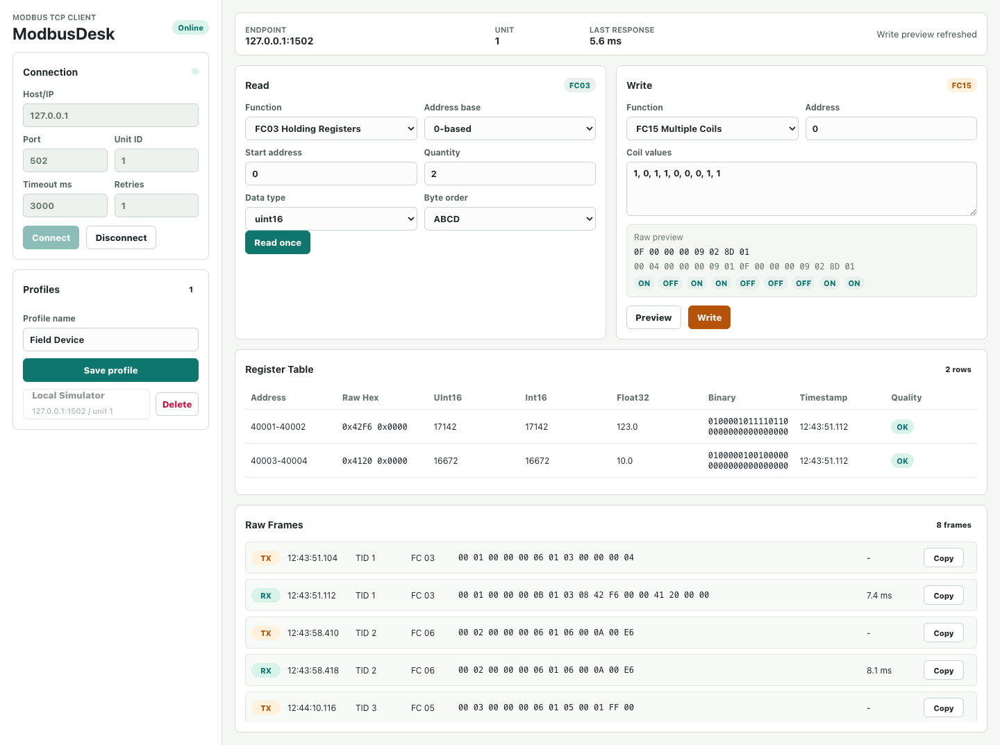
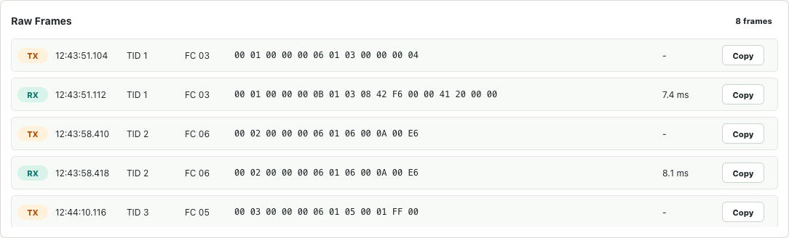

# ModbusDesk

[](https://github.com/keremvatandas/modbus-desk/actions/workflows/ci.yml)
[](https://github.com/keremvatandas/modbus-desk/actions/workflows/release.yml)

ModbusDesk is a focused Modbus TCP client for desktop testing, debugging, and quick field checks.

It is built with Go, Wails v2, React, and TypeScript. The first release targets macOS, while the codebase stays portable for future Windows and Linux builds.



## Why

ModbusDesk is intentionally small. It is not a SCADA system, commissioning suite, register-map editor, or serial/RTU tool. The goal is to open the app, connect to a Modbus TCP device, read or write a known coil/register, and inspect the exact MBAP frames when something does not behave as expected.

## Features

- Connect to a Modbus TCP device with host, port, unit ID, timeout, and retry count.
- Default TCP port is `502`.
- Read coils with `FC01`.
- Read discrete inputs with `FC02`.
- Read holding registers with `FC03`.
- Read input registers with `FC04`.
- Write a single coil with `FC05`.
- Write a single holding register with `FC06`.
- Write multiple coils with `FC15`.
- Write multiple holding registers with `FC16`.
- Preview raw write frames before sending.
- Require confirmation before every write.
- Inspect raw TX/RX Modbus TCP frames.
- Decode register values as `UInt16`, `Int16`, `Float32`, `Hex`, and `Binary`.
- Support `ABCD`, `BADC`, `CDAB`, and `DCBA` byte orders for `Float32`.
- Display 0-based or 1-based addresses.
- Save and load local JSON connection profiles.
- Test locally with the included Modbus TCP simulator.



## Safety Model

Industrial writes can have real device impact, so ModbusDesk keeps the write path deliberately conservative:

- Connection fields are locked while connected.
- Write confirmation uses the active backend session target, not editable form text.
- Write functions are not retried automatically.
- Modbus exception responses are treated as protocol responses, not transport failures.
- Raw write preview is shown before execution.

Keep these guardrails in place when adding more write functions.

## Product Readiness

Current status: ModbusDesk is ready for Modbus TCP lab testing, simulator-based demos, and controlled field checks against known devices. It is still pre-1.0 as a packaged desktop product because the release artifacts are unsigned and native installers are not available yet.

Ready:

- Core Modbus TCP workflows for `FC01`, `FC02`, `FC03`, `FC04`, `FC05`, `FC06`, `FC15`, and `FC16`.
- Conservative write flow with preview, confirmation, echo validation, and no automatic write retries.
- Local simulator for repeatable smoke testing without hardware.
- CI coverage for Go tests, race tests, `go vet`, vulnerability checks, frontend build, and desktop artifacts.
- MIT license, security policy, changelog, and release checksums.

Remaining release polish:

- Code signing and notarization.
- Native installers/packages for Windows and Linux.
- CSV/JSON export for current read results and frame logs.
- Broader manual verification against real device families before calling a release production-grade for industrial use.

## Scope

Supported now:

- Modbus TCP only
- `FC01` Read Coils
- `FC02` Read Discrete Inputs
- `FC03` Read Holding Registers
- `FC04` Read Input Registers
- `FC05` Write Single Coil
- `FC06` Write Single Register
- `FC15` Write Multiple Coils
- `FC16` Write Multiple Registers
- Raw frame inspection
- Basic local profiles

Intentionally out of scope for the current version:

- RTU, ASCII, and serial ports
- CSV register-map import
- Device commissioning workflows
- Polling dashboards
- SCADA-style historical storage

## Requirements

- Go `1.23+`
- Node.js and npm
- Wails v2 CLI

Install Wails if needed:

```bash
go install github.com/wailsapp/wails/v2/cmd/wails@latest
```

## Quick Start

Download builds from the latest GitHub Release:

- macOS: `ModbusDesk-macos-universal.zip`
- Windows: `ModbusDesk-windows-amd64.zip`
- Linux: `ModbusDesk-linux-amd64.tar.gz`

Release assets include SHA256 checksum files and a combined `SHA256SUMS.txt`.

Current builds are unsigned. macOS and Windows may show an operating-system trust warning on first launch.

## Build From Source

Install frontend dependencies:

```bash
cd frontend
npm install
```

Run the desktop app in development mode:

```bash
wails dev
```

Build the macOS app:

```bash
wails build
```

The generated app is written under `build/bin/`.

Cross-platform builds are produced by GitHub Actions on native runners.

## Local Simulator

ModbusDesk includes a small Go-based Modbus TCP simulator for smoke testing without hardware.

Run it on a non-privileged port:

```bash
go run ./cmd/modbus-sim -host 127.0.0.1 -port 1502
```

Connect from ModbusDesk with:

```text
Host: 127.0.0.1
Port: 1502
Unit ID: 1
```

Seeded values:

- `FC01`, address `0`, quantity `10` -> `ON, OFF, ON, ON, OFF, OFF, OFF, ON, ON, OFF`
- `FC02`, address `0`, quantity `8` -> `OFF, ON, OFF, OFF, ON, ON, ON, OFF`
- `FC03`, address `0`, quantity `2`, `Float32 ABCD` -> `123.0`
- `FC03`, address `2`, quantity `2`, `Float32 ABCD` -> `10.0`
- `FC04`, address `0`, quantity `2`, `Float32 ABCD` -> `100.0`
- `FC05` writes update coils in memory.
- `FC06` writes update holding registers in memory.
- `FC15` writes update multiple coils in memory.
- `FC16` writes update multiple holding registers in memory.

## Validation

Run the backend and frontend checks:

```bash
go test ./...
go test -race ./...
go vet ./...
cd frontend && npm run build
```

Optional desktop build check:

```bash
wails build
```

The test suite covers decoder behavior, validation rules, Modbus exception handling, no-retry write safety, and fake-server integration for read/write function codes and frame logging.

## GitHub Automation

The repository includes GitHub Actions for open-source development:

- `CI` runs Go tests, race tests, `go vet`, `govulncheck`, frontend build, and desktop builds for macOS, Windows, and Linux on every `main` push.
- `Release` builds and uploads macOS, Windows, and Linux artifacts when a version tag is pushed.
- Dependabot tracks Go modules, frontend npm packages, and GitHub Actions updates.

Main branch artifacts are available from the completed `CI` workflow run:

- `ModbusDesk-macos-universal.zip`
- `ModbusDesk-windows-amd64.zip`
- `ModbusDesk-linux-amd64.tar.gz`

Each artifact includes a `.sha256` checksum file.

Create a release by pushing a version tag:

```bash
git tag v0.3.0
git push origin v0.3.0
```

## Project Layout

```text
.
├── app.go                  # Wails app methods exposed to the frontend
├── cmd/modbus-sim/         # Local Modbus TCP simulator
├── frontend/               # React + TypeScript UI
├── internal/modbus/        # Modbus TCP client, frame logger, codec, validation
└── internal/profiles/      # JSON profile store
```

## Roadmap

- CSV/JSON export for current read results and frame logs
- Code-signed release artifacts
- Native installers/packages for Windows and Linux

The roadmap keeps the app as a testing tool. Register-map import and commissioning workflows should remain separate unless the project intentionally changes direction.

## License

MIT. See [LICENSE](LICENSE).
